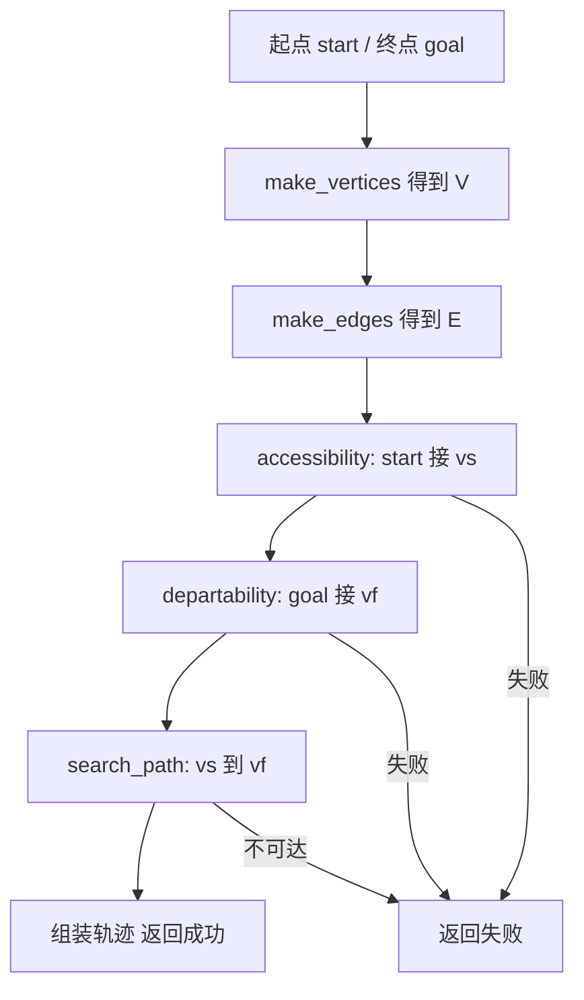

# 第 3 讲（扩展版）：读懂骨架 —— `solve` 流水线与 PRM 六步对应（小白向）

> **课程**：EN.601.663 Assignment 3  
> **前置**：[第 1 讲](./lecture01_环境与MoveIt入门.md) 环境能编译启动；[第 2 讲](./lecture02_MoveIt界面与场景规划.md) 会用 RViz 发场景、点 Plan。  
> **目标**：打开课程提供的 C++ 骨架后，能画出 **`solve` 里谁先谁后**、每个待实现函数对应 PRM 哪一步、**`state_collides` / `interpolate`** 该在什么环节调用 —— **本讲不写完整算法代码**（实现从第 4 讲起逐段做）。  
> **说明**：PDF 里路径偶有断行；常见文件名为 `assignment3_context.h` 与 `assignment3_context.cpp`（在包 `assignment3` 的 `src/` 下）。若你拿到的文件名略有不同，以 **包内实际文件** 为准，对照本节「任务清单」即可。

---

## 0. 任务实现总览：数据流、函数顺序与编码路线（写代码前必读）

下面这张表是 **`solve` 一次 Plan 的「主干逻辑」**；具体调用顺序 **以你仓库里的 `solve` 为准**，但绝大多数骨架与下表 **一致**。实现时请 **自顶向下**：先保证 **数据在函数之间传递正确**，再抠性能。

### 0.1 单次规划中的数据流（从输入到轨迹）

| 步骤 | 函数（示意名） | 产出 / 状态 | 依赖什么 | 失败时优先怀疑 |
|------|----------------|-------------|----------|----------------|
| ① | `make_vertices` | 无碰撞顶点集 **V**（带固定索引） | `state_collides`、关节范围 | **\|V\|=0**、采样越界 |
| ② | `make_edges` | 邻接表 **adj**、边权（可选） | **V**、`interpolate`+`state_collides` | **k 太小 / Δ 太大穿模**、忘清空旧图 |
| ③ | `search_accessibility` | 索引 **vs**，且 **start↔vs** 边有效 | **V**、与 ② 相同的 `edge_valid` | **m 太小**、start 附近无点 |
| ④ | `search_departability` | 索引 **vf**，且 **goal↔vf** 边有效 | 同上 | **m 太小**、goal 在窄通道外 |
| ⑤ | `search_path` | **vs→vf** 的顶点序列 | **adj** | **不连通**（n/k 不足） |
| ⑥ | `solve` 收尾 | **MoveIt 轨迹 / 成功标志** | ⑤ + 拼接 **start→vs…vf→goal** | 拼接顺序、时间参数化 |

**硬依赖链**：② 依赖 ①；③④ 依赖 ①②；⑤ 依赖 ② 且需要 ③④ 给出的 **vs、vf**；⑥ 依赖 ①～⑤ 的 **全部结果**。

### 0.2 推荐编码顺序（与讲义 4～8 讲一一对应）

1. **先实现 ①②**，并抽出 **共用的 `edge_valid(qa,qb)`**（与 **第 4～5 讲** 一致）。  
2. **再实现 ③④**（**第 6 讲**），不要改 `edge_valid` 的步长标准。  
3. **然后 ⑤**（**第 7 讲**）。  
4. **最后在 `solve` 里串起来 + 拼轨迹**；**第 8 讲** 加 **重试** 与 **n、k、Δ、m** 调参。  

**不要** 跳过 ② 先写 ⑤：没有 **adj**，最短路无从谈起。

### 0.3 本讲在整条学习线中的位置

| 讲次 | 内容 |
|------|------|
| 第 1–2 讲 | 环境、RViz、能发场景、能点 Plan |
| **第 3 讲（本讲）** | **读骨架** + 理解上表；在纸上画出 **`solve` 真实调用顺序** |
| 第 4～7 讲 | 按 **0.2** 顺序实现 **①～⑤** |
| 第 8～9 讲 | 联调、专家挑战、打包提交 |

读完本讲，你应能 **指着头文件** 说明：**每一步的输入输出** 与上表哪一格对应。

---

## 1. 为什么必须先读骨架再写 PRM？

PRM 课本上都有伪代码，但 **作业里的数据类型** 来自 MoveIt（`RobotState`、规划场景指针等）。骨架已经帮你：

- 接好 **规划请求**（起点、终点、关节模型）；  
- 提供 **单点碰撞** 与 **两点间插值** 的入口；  
- 规定 **`solve` 的大致调用顺序**（你实现子函数，但 **谁先调谁** 要以实际代码为准）。

若跳过阅读直接抄伪代码，常见后果：**在错误的阶段调碰撞**、**起点没接进图**、**返回值格式与 MoveIt 期望不一致**。

---

## 1.5 课堂 digest：`week05.pdf`（Sampling-Based Motion Planning）与作业怎么对齐

以下是对 **老师 PPT**（*Algorithms for Sensor-Based Robotics: Sampling-Based Motion Planning*，材料署名 CS 336 / G.D. Hager，部分幻灯来自 S. LaValle、E. Plaku）的**压缩理解**，用来和 **`assignment3` 的六个函数** 对上号。你本地若保存为 `week05.pdf`，可与本节对照阅读。

**更长版本**：`week06.pdf` 与 `week05.pdf` **前半重叠**，**后半** 增加 **窄通道与采样策略、RRT/EST、扩张性** 等；**与查询 / 起终点接线** 最相关的 **咀嚼** 见 **[第 6 讲](./lecture06_accessibility_departability.md)** 中的 **§2**。

### 路图（Roadmap）在讲什么？

- **自由构型空间 \(Q_{\mathrm{free}}\)** 难以精确构造；路图用 **一批无碰撞构型 + 一批可行局部运动** 去 **近似** 它。  
- PPT 图示：**试一个构型 → 碰撞就丢弃（discard）→ 不碰撞就保留 → 重复多次**；再在保留点之间 **连接（connect）**，且 **沿连接整条路径都无碰撞** 才保留边。  
- 规划请求时，用的是这份 **近似**，而不是「完全显式」的 \(Q_{\mathrm{free}}\)（与 PPT「用近似代替真实未知自由空间」一致）。

### 路图的三个要素（与作业函数名一一对应）

PPT 里 **Roadmap** 的查询条件写成三件事（记号与幻灯一致）：

| PPT 术语 | 含义 | 本作业里大致对应 |
|----------|------|------------------|
| **Accessibility** | 从 **\(q_{\mathrm{start}}\in Q_{\mathrm{free}}\)** 到路网上某点 **\(q'\)** 有一条无碰撞路径 | **`search_accessibility`**（start 接到 **vs**） |
| **Departability** | 从路网上某点 **\(q''\)** 到 **\(q_{\mathrm{goal}}\in Q_{\mathrm{free}}\)** 有一条无碰撞路径 | **`search_departability`**（goal 接到 **vf**） |
| **Connectivity** | 路图内部 **\(q'\)** 与 **\(q''\)** **连通**（图上可走） | **`search_path`**（**vs → vf**） |

**建图阶段**对应：**采样顶点** → **连边**，即 **`make_vertices`** + **`make_edges`**。

### 为什么用「概率式」方法？（PPT 小结）

- **显式构造** 整个 \(Q_{\mathrm{free}}\) 极难：PPT 提到与 **PSPACE-hard** 等相关结论（了解即可，实现作业不必证）。  
- **PRM**（Kavraki 等，**multi-query**：建一次图、多次查询）用 **采样 + 局部连接 + 高效碰撞检测**；**RRT / EST** 更偏 **single-query**（单次查询建树）。本作业实现的是 **PRM 式** 流水线。  
- **概率完备性（probabilistically complete）**（PPT）：在合理假设下，**样本数 \(n\to\infty\)** 时，**失败概率可任意小** —— 这解释了你为何能用 **[第 8 讲](./lecture08_联调与重试.md)** 的 **重试 + 增大 n** 提高成功率（不是「玄学」，有理论背景）。

### 查询阶段 PPT 还提醒什么？

- 把 **起点 / 终点** 接到路网上后，在 **图上做搜索**；若需要，可对路径 **平滑（smooth）**（本作业 **非必须**，MoveIt 侧也可能另有处理）。  
- **图不连通**：可能是 **空间本身不连通**，也可能是 **采样不够 / 近邻太少**（PPT：**「没试够」** vs **真不连通**）—— 与 **[第 8 讲](./lecture08_联调与重试.md)** 的排查表一致。

---

## 2. 在包里找到要改的文件

在工作空间 `src` 下的 **`assignment3`** 包中（路径以你机器为准）：

```text
assignment3/
├── src/
│   └── assignment3_context.cpp   ← 多数实现写在这里（或课程命名的等价文件）
├── include/.../assignment3_context.h   ← 类声明、函数声明与注释
├── CMakeLists.txt
└── package.xml
```

**本讲任务**：用编辑器打开 **`.h` 与 `.cpp`**，从 **`solve`**（或等价公有接口）开始 **顺着调用往下读**。

---

## 3. PRM 复习：六个评分点与「图」的直觉

（上节 **§1.5** 已从 **Week05** 角度解释 **Accessibility / Departability / Connectivity**；下表是 **作业记分** 拆分。）

课程要求你实现（名称以 PDF / 头文件为准，可能为驼峰或下划线）：

1. **make_vertices** —— 构造无碰撞顶点集 **V**（关节 ±π 内采样）。**（1 分）**  
2. **make_edges** —— 在 **V** 上连无碰撞边 **E**。**（2 分）**  
3. **search_accessibility** —— 起点接到某个 **vs ∈ V**。**（1 分）**  
4. **search_departability** —— 终点接到某个 **vf ∈ V**。**（1 分）**  
5. **search_path** —— 在图上从 **vs** 到 **vf** 找路径。**（3 分）**  
6. **Expert challenge** —— 调参过难题（第 9 讲侧重），**非单独一个函数名**，但依赖前五步质量。**（1 分）**

**小白记忆**：

- 先建 **路网点（V）** 和 **路（E）**；  
- 再把 **车库（起点）** 和 **目的地（终点）** 接到路上；  
- 最后在 **地图** 上导航 **vs → vf**。

---

## 4. `solve` 里 typical 的顺序（务必以你的 `.cpp` 为准）

**与 §0.1 主表一致**；这里侧重 **你读源码时要核对** 的调用名与失败分支。

PDF 说明：每次在 MoveIt 里点 **Plan**，会调用 **`solve`**。骨架里 **`solve`** 会依次调用你实现的若干方法。

**逻辑上**（经典 PRM **查询**流程）常与下面一致 —— **若你的源码顺序不同，以源码为准**：

```text
1. 取得起始关节状态、目标关节状态（或经 IK 得到的目标）
2. make_vertices        → 得到 V
3. make_edges           → 得到 E（邻接表或边列表）
4. search_accessibility → start 连上 vs，失败则整体失败
5. search_departability → goal 连上 vf，失败则整体失败
6. search_path          → vs 到 vf 的最短（或可行）路径
7. 把路径拼成 MoveIt 需要的轨迹/路径消息并返回成功
```

**你要做的事**：在 IDE 里全局搜索 `solve`，**把实际调用的每一行按顺序抄在笔记本上**，与上表对照。若有 **重试循环**（失败再采样一轮），也在笔记里标出来。

---

## 5. 两个关键工具：你必须会用

### 5.1 `state_collides`（名字以头文件为准）

- **输入**：通常是一个 **关节构型**（或包装在 `RobotState` 里 —— 以注释为准）。  
- **输出**：该构型是否与 **当前 Planning Scene** 发生 **碰撞**（含自碰，取决于课程封装）。  
- **用途**：  
  - 采样顶点时：**碰撞则丢弃**；  
  - 检验边时：**不能只测端点**，中间也要测（见下节 `interpolate`）。

### 5.2 `interpolate`（名字以头文件为准）

- **输入**：两个端点构型 **qA、qB**，以及参数 **s ∈ [0, 1]**（或离散下标 —— 以注释为准）。  
- **输出**：在 **关节空间** 上从 A 到 B **线性插值**（或课程指定的插值方式）得到的中间构型。  
- **用途**：检验边 **(vi, vj)** 时，取一串 **s = 0, Δ, 2Δ, …, 1**，对每个中间点调用 **`state_collides`**；任一点碰撞则 **该边不存在**。

**小白口诀**：**边 = 很多个中间姿态排成队，每个姿态都不能撞。**

---

## 6. 六个函数与「该问自己的问题」

读头文件时，每个函数旁建议写清 **输入 / 输出 / 失败时怎么办**。

| 函数（示意名） | 你要问自己的问题 |
|----------------|------------------|
| **make_vertices** | 采样分布用均匀随机可以吗？目标顶点个数是多少、达不到怎么办？每个关节是否在 **[-π, π]**？ |
| **make_edges** | 用 **k 近邻** 还是 **半径**？距离用关节空间欧氏距离吗？边上采样步长 **Δ** 取多大？ |
| **search_accessibility** | **start** 在不在 `V` 里？通常 **不在**，要临时连向 **V** 中最近的若干点；连几条失败算失败？ |
| **search_departability** | 与 accessibility **对称**；goal 是否多解（IK）以骨架为准。 |
| **search_path** | 图用 **邻接表** 存吗？边权用什么？用 **BFS / Dijkstra**？不可达返回什么？ |
| **solve 收尾** | 路径是 **顶点序列** 还是直接要 **RobotTrajectory**？骨架是否已提供填充轨迹的辅助代码？ |

PDF 写明：**可以改函数参数与返回值**，也可 **增加成员变量/方法**；改完后只要 **整包能编译**、**行为符合规划接口** 即可。

---

## 7. 和 MoveIt 概念的对应（巩固第 1 讲）

- **RobotState**：保存一组关节值；你的每个 **PRM 顶点** 往往对应（或可拷贝到）一个 `RobotState`。  
- **Planning Scene**：障碍来自 RViz **Publish** 后的场景；**`state_collides`** 内部应使用 **同一场景**，否则会出现「界面有桌子、代码当没桌子」。  
- **规划组**：通常只规划手臂关节；采样维度 = 该组 **可控关节数**（以模型为准，UR5 常为 6）。

---

## 8. 建议的阅读顺序（跟做，约 60–90 分钟）

1. **只读 `.h`**：列出所有 **protected/private 成员**（图、顶点容器、随机数引擎等是否已预留）。  
2. **找到 `solve` 声明与实现**：把调用链 **抄成一张图**。  
3. **精读六个函数的注释**：把每个参数标在纸上。  
4. **搜索 `state_collides` / `interpolate`**：看谁调用谁，各出现几次。  
5. **搜索 `return false` / 错误路径**：失败时是否 **清理状态**、是否 **日志可读**。  
6. **尝试 `colcon build --packages-select assignment3`**：空实现应能 **编译通过**；运行 launch 点 Plan 可能 **失败**（预期行为）。

---

## 9. 用 Mermaid 把「典型 PRM 查询」记在笔记里（可选）

下面的图是 **概念图**；若你的 `solve` 在失败时会 **重试整个采样**，可在图上自己加循环。



---

## 10. 本讲动手清单

- [ ] 定位 `assignment3_context.h` 与 `.cpp`（或课程等价命名）。  
- [ ] 手写 **`solve` 调用顺序**（与源码一致）。  
- [ ] 为六个函数各写一行：**输入是什么、输出是什么、失败条件**。  
- [ ] 解释给同学听：**为什么边上要 `interpolate` + `state_collides`，不能只测两个端点**。  
- [ ] **空包能编译**；launch 后点 Plan 可失败，但 **不崩溃**。

---

## 11. 自检问答题

1. **accessibility** 和 **make_edges** 里「连边」的碰撞检验有什么相同、有什么不同？  
2. 若 **|V| = 0**（一个顶点也没采到），你期望 **`solve` 应该怎样结束**？  
3. **departability** 失败时，更可能是 **goal 太刁** 还是 **图不连通**？如何区分（不靠猜，靠你打算打什么日志）？

---

## 12. 常见误区（读代码阶段就要避开）

- **误区 1**：顶点采样 **超出关节限位** —— PDF 要求 **±π**，以 **规划组限位与作业要求** 同时核对。  
- **误区 2**：**make_edges** 里只对端点做 `state_collides` —— 容易 **穿模**。  
- **误区 3**：**start / goal 默认在 V 里** —— 经典做法是 **查询阶段** 才把 start、goal 连到路网上。  
- **误区 4**：**search_path** 只搜 **原图上的点**，忘记路径里还要 **接上 start→vs 与 vf→goal**（具体拼接是否在 `solve` 里做，看骨架）。

---

## 13. 学术诚信提醒

课程规定 **不得使用代码生成/补全类工具完成提交代码**。本讲只帮你 **建立结构与概念**；**具体 C++ 实现请独立完成**。若需要伪代码级提示，第 4 讲起会按 **make_vertices** 分段给 **思路级** 步骤（仍非可复制提交的完整答案）。

---

## 14. 下一讲预告

**[第 4 讲：make_vertices 顶点采样](./lecture04_make_vertices顶点采样.md)** —— 在 ±π 内拒绝采样、`state_collides` 过滤、随机种子与调试。

---

## 参考

- 课程 PDF：Sampling-Based Planner、§4.1 Implementation。  
- 课堂幻灯 `week05.pdf`、`week06.pdf`（后者为前者的扩展版；**查询阶段与难例** 见 [第 6 讲 §2](./lecture06_accessibility_departability.md)），与 **§1.5** 对照。  
- MoveIt 2（Humble）：<https://moveit.picknik.ai/humble/index.html>（RobotModel、RobotState）。  

---

*讲义版本：扩展第 3 讲 · 与课程 PDF §4.1 及 `week05.pdf` 对齐 · 仅供学习梳理使用。*
